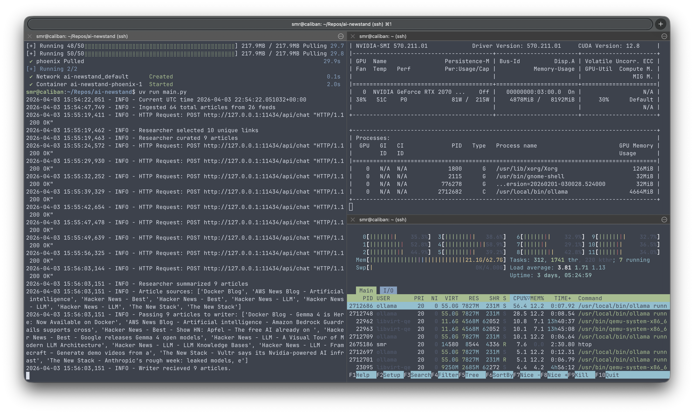

# Learning Journal

Notes and random thoughts landing page for experimenting with the models and application.

## 3/4/26

[Generated Newsletter](2026-03-04-Newsletter.md)

- qwen3.5:9b is badass
- running on my homelab with less vram causes the researcher to just dump a summary cause the context is much smaller 4096 vs 3768 on the macbook, unified memory is really quite awesome.
- the 4b size of qwen3.5 was noticeably worse when it came to handling incomplete articles and following directions. the editor never caught on that these articles should be cut and the writer produced less content overall.

`nvidia-smi` output during a runtime load with 

```python
RESEARCHER_MODEL = "qwen3.5:9b"
WRITER_MODEL = "qwen3.5:9b"
EDITOR_MODEL = "qwen3.5:9b"
NUM_CTX = 32768
```
So the 9b actually fits OK on the NVIDIA RTX 2070S with 8GB VRAM. It is noticebly slower however.

```txt
Wed Mar  4 09:41:20 2026       
+-----------------------------------------------------------------------------------------+
| NVIDIA-SMI 550.120                Driver Version: 550.120        CUDA Version: 12.4     |
|-----------------------------------------+------------------------+----------------------+
| GPU  Name                 Persistence-M | Bus-Id          Disp.A | Volatile Uncorr. ECC |
| Fan  Temp   Perf          Pwr:Usage/Cap |           Memory-Usage | GPU-Util  Compute M. |
|                                         |                        |               MIG M. |
|=========================================+========================+======================|
|   0  NVIDIA GeForce RTX 2070 ...    Off |   00000000:03:00.0  On |                  N/A |
| 39%   52C    P2             87W /  215W |    7567MiB /   8192MiB |     37%      Default |
|                                         |                        |                  N/A |
+-----------------------------------------+------------------------+----------------------+
                                                                                         
+-----------------------------------------------------------------------------------------+
| Processes:                                                                              |
|  GPU   GI   CI        PID   Type   Process name                              GPU Memory |
|        ID   ID                                                               Usage      |
|=========================================================================================|
|    0   N/A  N/A      1950      G   /usr/lib/xorg/Xorg                             94MiB |
|    0   N/A  N/A      2203      G   /usr/bin/gnome-shell                           57MiB |
|    0   N/A  N/A   3666360      C   /usr/local/bin/ollama                        7410MiB |
+-----------------------------------------------------------------------------------------+
```

Big improvement over the failed 4B run. Comparing to yesterday's 9B MacBook output:

- 9 articles curated and summarized (vs yesterday's 10)
- Clean markdown formatting with proper [Title](link) syntax, althought not exactly what I intended this might actually work better to have the source be the link?
- Story of the Day has real depth
- Good topic diversity: storage, agents, security, models, MLOps

Overall I would call that a success. Something funny is there is a story that was also in yesterdays generated report. I need to add a DB with some sort of memory on like the past week or maybe 30 days of stories so it doesn't go repeating itself. The editor could access that or maybe the curator actually .. get new stories only.

## 3/6/26

I did some minor updates to the prompt for the writer and editor. It seems like qwen3.5 had to be told more than once to format links in the correct way for Markdown hyperlinks. I think it finally got it this time. The key was the explicit instructions not just the example, I included the following in the writer's prompt:

```txt
- For title links, enclose the link text in square brackets [] and immediately follow it with the URL in parentheses ()
```

The results were pretty awesome, I actually liked reading this morning's edition and I feel like I learned some things and went and read some of the original articles that were of greater interest to me.

I really need to get MLFlow cooking and the runs of this automated so I can do some more precise experimentation and evaluations.


## 3/8/26

I've had a crontab for this guy in my homelab PC for a couple of days now.. I really need to set up logging to a file ..

The issues with the link format seem to be somewhat transient, not sure exactly where in the process the formatting is getting dropped. Perhaps I need to just write some strict post-processing formatter that does some regex to fix the output. 

Also, it seems that despite instructions the writer is selecting articles with almost no substance in their content. The solution here is two-fold:
1. A more strict Judge/Editor (perhaps a new judge external to this system for evals)
2. A mechanism by which the researcher can fetch http and enrich the content with more valuable information when there isn't any. 

In fact getting the source material could be a parallelized step for each article to ensure the best quality. Feeding every single article in one prompt or even a few would probably be a waste. Instead I'm thinking about giving the model a prompt to assign some kind of numerical ranking on a 1 - 5 scale on how 'important' or relevant an article is, then hand the top 10 or so off to the writer. Details details..

I think what I really need to do is start tracking each revision of the newsletter draft along with the feedback by writing it to a file. Then, I can add in some tracing with MLFlow and use those alongside the prompts and everything as an artifact, before I go significantly changing the system.

Another idea I had is using a more powerful model like Claude periodically to provide feedback on the newsletter.. could be a good judge?

## 3/10/26

Added a local file saving so that the drafts and revisions from the editorial loop are captured for future artifact tracking. 

I updated the prompts a bit so the Editor is better at just responding LGTM and not providining aditional feedback that gets ignored because of how i've constructed the loop. But it seems like it favors just doing one pass since the first iteration from qwen3.5 is actually quite good which I agree on but I wonder if I should add some revision count context awareness to the editor call? Like "this is your n-th revision, the max is k" and have it be more skeptical early on to increase the chance of more revisions?

## 3/12/26

I wonder how much the editor is actually helping here. After setting up file writes for every edit and draft it's funny to see the editor accuse the writer of hallucinating content because it hallucinated that the content is fake, even alluding to how it checked and verified when I have given it no ability to do so just yet ... 

Obiously that's pretty high on my list for the editor to be able to use an MCP tool too pull down an article it thinks is suspicious. It also has a hard time understanding what the date is even though I've presented it in the prompt. 

Well adding that simple bit of code to fetch hmtl and decomp and parse it with beautifulsoup really worked wonders on some of those feeds. In particular it made HuggingFace blog actually workable because before I was getting barely any content and now it's the featured story of the latest edition! HA.

It's still mucking up the hyperlinks, even worse than before I added some more nudging to the prompt. I think I confused the poor guy. 

## 4/4/26

Gemma 4 is freaking Awesome! I did some evals against Qwen3.5:9b which was my previous guy but the 9b was a bit large on the 8GB 2070 GPU. This made it so I had to run a pretty thin context size but with `gemma4:e4b` the model takes up much less space in vram and I was able to double the KV cache allocation!

### gemma4:e4b



As you can see gemma takes up much less memory an taxes the overall system a lot less too, this is thanks to the MoE architecture only activating 4b parameters at a time. It's also noticeably faster! The output with the same prompts is noticeably more concise, this seems reasonable though given it is a MUCH smaller model.

| Metric | gemma4:e4b (15:54) | qwen3.5:9b (16:04) |
|---|---|---|
| Total runtime | 3.4 min | 6.8 min |
| Generation time | 143s | 330s |
| Gen throughput | 27.5 tok/s | 20.0 tok/s |
| Prompt eval | 2,042 tok/s | 1,008 tok/s |
| Completion tokens | 3,945 | 6,612 |
| Prompt tokens | 40,144 | 43,936 |
| LLM calls | 16 | 16 |

But how doe the generations actually compare? I would say they are really impressive. I'm willing to swtich away from Qwen3.5. I think this model the way I had it prompted was rubberstamping the 'LGMT' too much. This was in part because Qwen3.5:9b was such a damn good writer the first pass would pretty much hit the ball out of the park.. It did have that occasional struggle with the link hypertext formatting for markdown titles but I adjusted my prompting to mostly fix that. 

I'm really excited that I got prompts and actually everything from the `main.py` decomposed and prompts are now versioned in `prompts.py` witch some metadata, and I've got OpenInference tracing for OLTP sending it off to Phoenix! So I can start doing some more experiment tracking and messing with the prompts, I think this gemma4 model could stand to have some better few shot prompting for my desired outputs, especially since I can greatly increase the context window comapred to qwen3.5:9b.

Very impressed with this model so far, especially considering how good Qwen3.5:9b was but how BAD Qwen3.5:4b was when I tested it for this use case. I'm amazed at how well gemma can follow instructions and I haven't even really messed around with `thinking` or `temperature`!